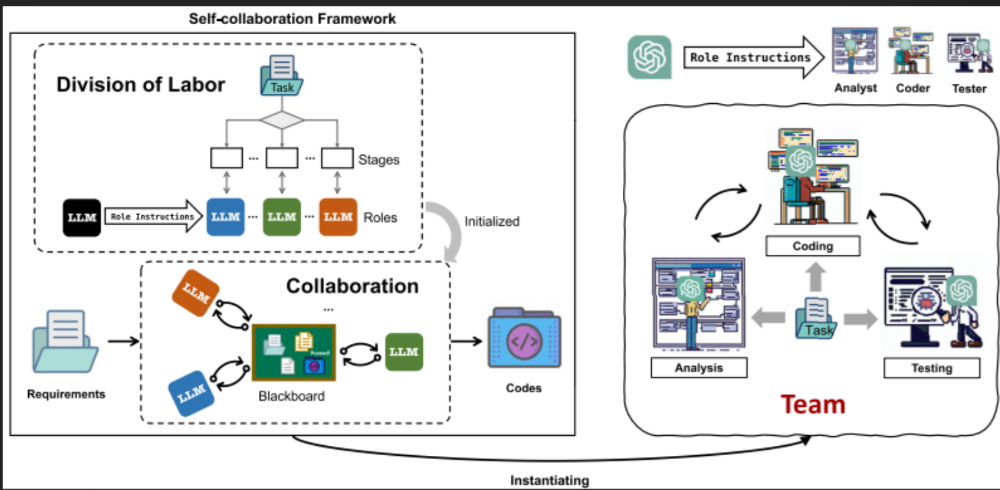
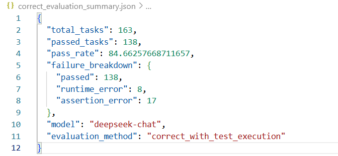
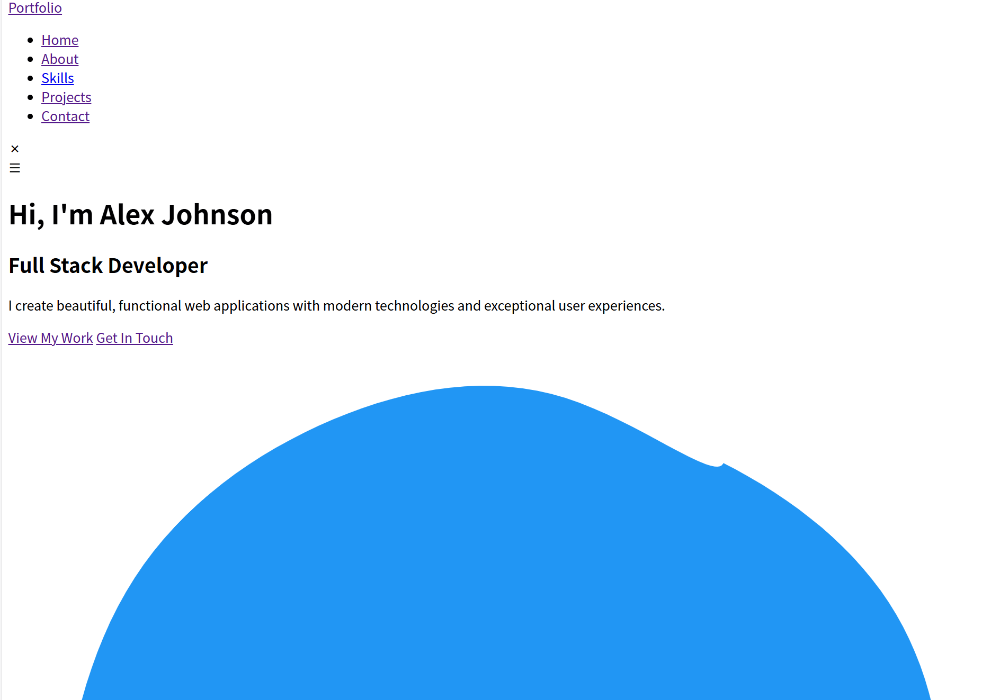
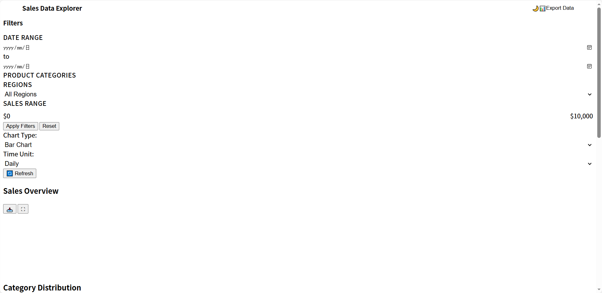

# Self-collaboration Code Generation via ChatGPT

The first LLM-based agent for (Function-Level and Project-Level) code generation in software engineering, released in April 2023, has been accepted to TOSEM.
#  1.论文总结

## 1.1研究问题 
论文指出，尽管LLMs在代码生成方面取得了显著进展，但在面对复杂任务时，单个LLM代理往往表现不佳。复杂任务通常需要多阶段协作，而人类通过团队分工来降低复杂性并提高质量。然而，直接训练多个LLM模型进行协作成本高昂，且缺乏有效的交互机制。因此，论文的核心问题是：如何让LLMs以低成本、高效的方式协作，以生成更可靠、复杂的代码，从而模拟人类团队开发流程。

## 1.2解决方案与创新点 
论文提出了一种自协作框架，通过角色指令让多个LLM代理扮演不同角色，形成一个虚拟团队，协作完成代码生成任务。创新点主要体现在以下方面：
1.分工与协作框架：
分工部分：将复杂任务分解为多个阶段，并为每个阶段分配特定角色。通过角色指令，LLMs被转化为领域“专家”，从专业视角处理子任务。
协作部分：角色之间通过自然语言交互，共享信息，迭代改进代码。协作流程遵循软件开发方法论，确保阶段间有序推进和反馈。
2.引入软件开发方法论：论文将瀑布模型融入框架，实例化一个基础团队。这种结构允许阶段间线性流动，并在发现问题时回溯修改，从而控制复杂性。
3.角色指令的作用：角色指令不仅定义角色职责，还规范交互格式，使LLMs能在特定上下文中推理，激发其潜在能力。相比直接提示或少量示例，角色指令更有效。
4.通用性与可扩展性：框架不限于代码生成，可扩展到其他领域。实验表明，该框架在多种基准上显著提升性能，并能处理仓库级任务。
论文的创新点在于首次将软件开发团队协作理念引入LLMs，通过角色指令实现完全自驱动的多代理协作，无需额外训练或人类干预。

## 1.3流程图 ：

# 2.公式与代码实现对照

本章节将论文中的关键数学模型与项目源代码进行对应，以展示理论到实践的转化过程。
| 公式编号 | 公式描述 | 对应代码文件 | 关键代码位置 | 功能说明 |
|---------|---------|------------|------------|---------|
| 论文式(1) | 任务定义 \( T: x \to y \) | project_session.py session.py | run_project_session() run_session() | 框架入口，处理需求输入和代码输出 |
| 论文式(2) | 任务分解 $$ \mathcal{T} \Rightarrow \{ S_i \}_{i=1}^l $$|project_session.py| run_project_session()  | 瀑布模型阶段划分（架构→UI→开发） |
| 论文式(3) | 角色分配 $$ \{ R_{i} \}_{j=1}^{m} \text{ based on } \{ S_{i} \}_{i=1}^{l} $$ | project_session.py | 第62-68行 | 角色实例化（架构师、开发者、测试员） |
| 论文式(4) | 协作概率模型 $$ \arg\max_{s_{t}} P\left(s_{t} \mid s_{\{<t\}}, R_{m}(s_{t}), x\right) $$ | project_session.py session.py | run_session() run_project_session() | 基于历史上下文的迭代代码生成 |
| 论文式(5) | 输出更新$$ y_t = f\left(s_t, y_{<t}\right) $$ | session.py project_session.py |  run_project_session()  run_session() | 迭代结果记录和版本管理 |
| 论文式(6) | Pass@1评估指标 $$ \text{Pass}@1 = \mathbb{E}_{\text{Problems}} [\mathbb{1}(\text{generated code})] $$| evaluation.py  | 第96-179行| 代码生成性能的概率评估 |

# 3. 安装说明

## 3.1环境要求
- 操作系统：windows
- Python 版本：2025.18.0
- 深度学习框架：自协作代码生成

## 3.2详细步骤 （考虑成本，本次复现用deepseek替代chatgpt）
### 3.2.1下载代码
git clone https://github.com/YihongDong/Self-collaboration-Code-Generation.git
cd C:\Users\HP\Desktop\新建文件夹\Self-collaboration-Code-Generation-main

### 3.2.2虚拟环境构建
在Self-collaboration-Code-Generation-main文件夹下打开bash终端：
python -m venv venv
source venv/Scripts/activate
pip install -r requirements.txt
export DEEPSEEK_API_KEY="sk-944eff79290e4267864b54d87db2032e"
echo $DEEPSEEK_API_KEY

### 3.2.3函数级代码生成
bash run.sh
bash evaluate.sh

### 3.2.4项目级别代码生成
bash run_project.sh

# 4.运行结果

## 4.1函数级代码生成

运行结果截图：

本工作 (DeepSeek Self-Collaboration): 84.66%
原论文 (ChatGPT Self-Collaboration): 74.4%
基础 ChatGPT: 57.3%
测试结果在correct_evaluation_results.json文件中
评估结果在correct_evaluation_summary.json文件中

## 4.2项目级别代码生成
运行结果截图：
(1)投资组合网站:

生成的文件为generated_portfolio
(2)交互式仪表板:

生成的文件为generated_dashboard
(3)数据可视化应用程序:

生成的文件为generated_analytics

